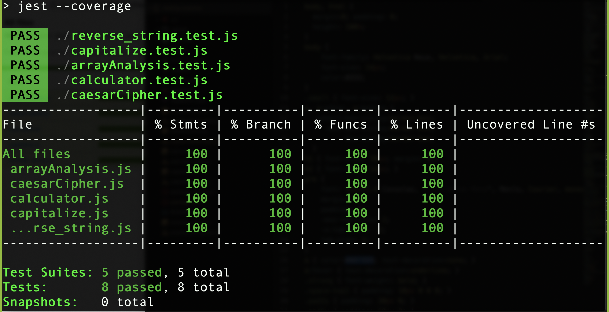

# JS-To-Do-List
Practicing testing with jest

## Built With

- JavaScript,
- Jest

## Screenshot

### Setup

- Fork the repo to your remote repository.
- Clone or download the repository to your local machine.

### Install

- Ensure that you have node.js and npm installed in your machine.
- Run `npm install`to install the project packages

### Usage section.

- Run `npm run test`to run the test.

## Authors

👤 **Rahma Halane**

- [Portfolio](https://raw.githack.com/imahnama/my-portfolio/develop/index.html)
- [Twitter](https://twitter.com/halane_rahma)
- [Linkedin](https://www.linkedin.com/in/rahmahalane/)
- [Email](mailto:Halane.rahma@gmail.com )

👤 **Odong Sunday**

- [Portfolio](https://odongsunday.netlify.app/)
- Github: [@OdongAlican](https://github.com/OdongAlican)
- Twitter: [@odongsandie](https://twitter.com/odongsandie)
- Linkedin: [Sunday Alican odong](https://www.linkedin.com/in/sunday-alican-odong/)
- [Email](mailto:sandieo.2020@gmail.com)

## 🤝 Contributing

Contributions, issues and feature requests are welcome!

Feel free to check the [issues page](https://github.com/imahnama/testing-practice/issues).

## Show your support

Give a ⭐️ if you like this project!
